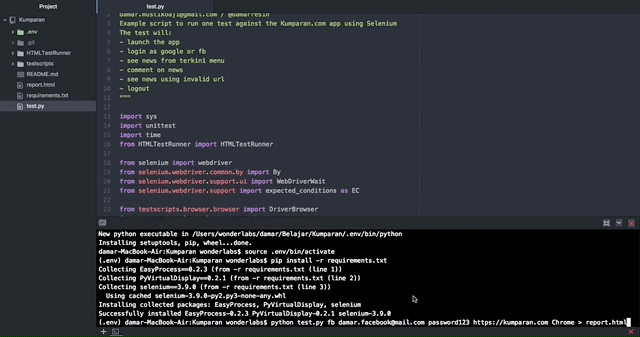

### Automation Testing Kumparan.com app

### Requrements
- EasyProcess==0.2.3
- PyVirtualDisplay==0.2.1
- selenium==3.9.0

### Arguments
- $: python test.py [account] [email] [password] [url] [browser] > report.html
- EX$: python test.py google damar katasandi http://kumparan.com HEADLESS > report.html

#### Note :
- account = "google" or "fb"
- browser = HEADLESS / VM / Default: Chrome
- Test Report = report.html (HTMLTestRunner)

### Chrome Driver
- directory "../driver"
- download https://sites.google.com/a/chromium.org/chromedriver/downloads

### How to use
1. Download chromedriver
2. Buat directory driver diluar directory project "../driver"
3. Masukkan chromedriver ke dalam folder tersebut
4. Install pip python $ sudo easy_install pip
5. Install virtualenv $ sudo pip install virtualenv
6. Buat virtualenv folder $ virtualenv venv
7. Aktifkan env $ source venv/bin/activate
8. Install requirements $ pip install -r requirements.txt
9. Run project $ python test.py google damargoogle katasandi https://kumparan.com Chrome > report.html

### GIF

